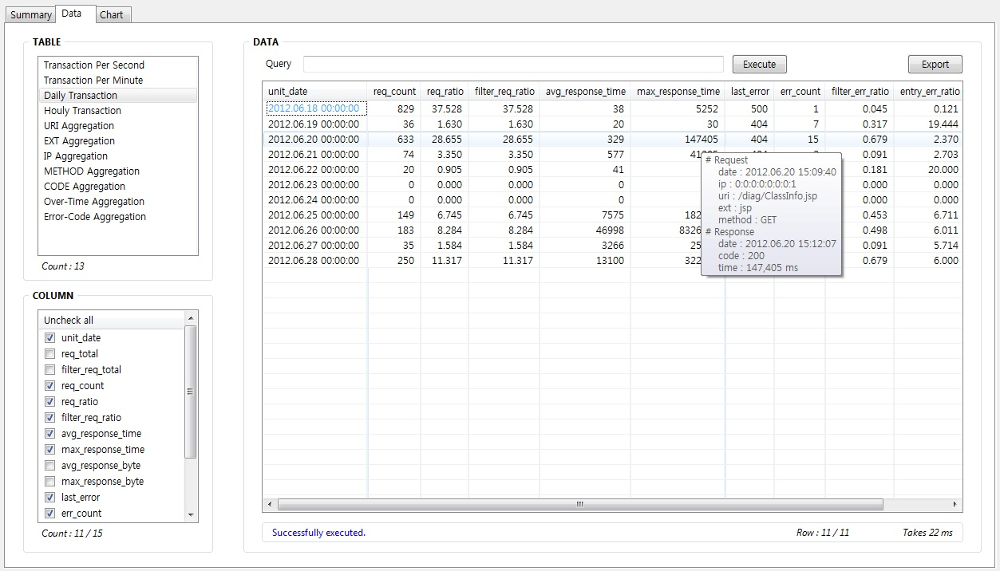

ALYBA (AccessLog & Your Bad Applications)
=============================
일반적인 미들웨어의 경우, 기본적으로 Accesslog를 이용하여 클라이언트 요청 정보를 기록한다. 여기에는 모든 요청에 대한 처리결과가 기록되어 있으므로, 이것을 이용하여 시스템의 성능을 분석할 수 있다. 가령, PeakTime은 언제인지, 최대 몇 TPS를 처리하는지, 응답시간 지연이 얼마나 발생하며 어떤 요청이 주로 지연되는지, 오류비율은 얼마나 되는지 등을 Accesslog를 통해 분석이 가능하다. ALYBA는 Accesslog를 분석하여 시스템의 현황을 점검하고 더 나아가 악성 어플리케이션을 식별하기 위한 목적으로 개발되었다.

Requirements
---------------
* Windows OS
* JRE 8.0 이상

Getting Started
---------------
아래의 두개 버전 중 하나를 다운로드 한다.
* Windows Executable : [ALYBA_v1.9.0.exe](https://github.com/cool8519/ALYBA/releases/download/v1.9.0/ALYBA_v1.9.0.exe)
* Java Archive File : [ALYBA_v1.9.0.jar](https://github.com/cool8519/ALYBA/releases/download/v1.9.0/ALYBA_v1.9.0.jar)

ALYBA 실행파일을 클릭하거나, 커맨드 창에서 실행시키면 된다.
`C:\> ALYBA.exe`

Excutable Binary 파일(exe)은 Windows 환경에 따라 수행이 안될 수 있다. 이 경우는 JAVA Archive 파일(jar)을 아래와 같이 수행할 수 있다.

`C:\> java -jar ALYBA.jar`

결과 분석창은 메인화면에서 "Result Analyzer"버튼을 눌러서 열 수 있다. 그러나 아래와 같이 별도의 결과 분석창을 열 수 있다.

`C:\> ALYBA.exe -result [path_to_alyba_db]`

`C:\> java -jar ALYBA.jar -result [path_to_alyba_db]`

Usage
---------------
ALYBA를 사용하기 위해서는 아래의 순서를 따른다.

##### 1. 제목 입력
툴의 가장 상단에 위치한 Title 부분에 분석에 대한 제목을 입력한다.
텍스트 형태로 입력이 가능하며, 입력한 Title은 출력 결과물의 파일명에 사용된다. 그러므로 Title은 공백을 지양하고 Underscore(_) 사용을 권장한다. 동일한 파일명이 존재할 때는 “_번호”를 suffix로 붙인다. Title을 “WAS1_업무1”로 입력한 경우, 출력 파일의 이름은 “ALYBA_WAS1_업무1”이 된다.

##### 2. 파일 선택
분석을 수행 할 대상 로그파일을 지정한다.
툴 상단의 Title 아래가 파일관리 부분이며, 아래의 Open Files(s), Remove Selected, Remove All 버튼을 이용하여 파일을 추가하고 제거할 수 있다. 편의를 위해서 아래의 기능을 제공한다.
* 키보드(Shift,Delete) 사용 가능
* 마우스(Drag&Drop) 사용 가능
* 파일 드래그 : 해당 파일이 추가
* 폴더 드래그 : 폴더 내 전체 파일이 추가
* <kbd>Ctrl</kbd> + 폴더 드래그 : 폴더 내 파일명이 패턴과 일치하는 파일만 추가

선택된 파일을 Double-Click 함으로써 파일의 내용을 확인할 수 있으며 아래의 항목을 확인할 수 있다.
* Show headers : 파일에 헤더부분이 있을 경우, 내용과 필드 이름을 보여준다.
* Open file : 윈도우에 연결된 프로그램을 통해 파일을 오픈한다.

> Accesslog 포멧이 동일한 로그만 추가해야 하며, 파일간 포멧이 다를 경우 분석 수행과정에서 오류가 발생함

##### 3. 필드 매핑
선택한 파일을 파싱하여 분석하기 위해서는 필드 순서와 이름을 매핑해 주는 것이 필요하다.
툴의 아랫부분에서 Mapping 탭을 선택한다. 매핑은 아래의 순서로 진행한다.
* Log Type 설정
  * Accesslog 포멧이 일반적인 WEB/WAS의 기본설정인 경우, 목록에서 해당 WEB/WAS 서버를 설정한다.
  * 목록에 존재하지 않는 서버를 사용하거나, 기본 포멧이 아닌경우는 Customized로 설정한다.
* Sampling & 자동 매핑
  * Log Type을 Customized로 설정하지 않은 경우는 간단히 Sampling 버튼만 누르면 자동으로 매핑을 수행하며, 아래의 과정은 불필요하다.
* Sampling
  * Delimeter에 필드 구분자를 설정한다. 구분자가 2개 이상일 경우는 붙여서 지정하면 된다. 예) -\t -> “-“와 “\t”(탭)을 구분자로 파싱
  * Bracelet에 필드 괄호기호를 설정한다. 괄호기호가 2개 이상일 경우는 공백을 넣어 지정하면 된다. 예) [] "" -> []와 “”는 하나의 필드로 파싱
  * 대부분의 경우는 Delimeter와 Bracelet은 기본값으로 남겨두어도 좋다.
  * Sampling 버튼을 누르면 Sampling된 라인의 필드 데이터가 좌측 아랫부분에 표시된다.
* Mapping
  * 좌측의 필드 데이터를 드래그하여 오른쪽의 적절한 필드에 드롭한다.
  * Request Time은 필수 매핑 항목이며, 나머지는 선택이다.
  * 좌측의 필드 데이터에 공백으로 구분된 Delimeter가 있을 경우, 선택적으로 매핑이 가능하다.
  * <kbd>Del</kbd>키로 매핑된 필드를 취소할 수 있다.
  * 시간은 기본적으로 UTC+0 기준으로 입력되므로, 로그가 기록된 서버의 TimeZone이 있는 경우는 Hour 단위로 Offset 설정을 한다. (예: IST=5.5시간)
  * 로그의 요청 URI가 RESTful URL 형식인 경우, URI Mapping에 패턴을 등록하면 매칭되는 패턴은 하나의 URI로 집계된다. (예: /user/myId123/get -> /user/{userId}/get)
* URI Mapping
  * 파일에서 읽어오려면 File Type을 선택한 뒤 파일을 선택하거나 드래그 앤 드롭한다.
  * 패턴을 직접 입력하여 목록을 작성하거나 수정할 수 있다.
  * 정의된 패턴은 정확히 일치해야 해당 패턴으로 요청이 그룹화 되며, 목록의 순서대로 매칭 여부를 확인한다.
  * 각 패턴 문자열에는 “{userID}”와 같이 가변 문자를 지정해야 하며, “{empNo:[\\d]+}”와 같이 ":" 뒤에 정규식 표현을 사용할 수 있다. (Springframework의 RequestMapping 문법 지원) 

##### 4. 필터링
필터링을 통해 전체 로그 중 일부만 내용만을 분석하는 것이 가능하다. 전체 로그를 분석하는 경우는 필터링 과정이 불필요하다.
툴의 아랫부분에서 Filter 탭을 선택한다. 필터링은 아래의 세가지 방식이 가능하다.
* Time Range : 시간범위를 지정
* Include Filter : 조건에 맞는 경우만 분석
* Exclude Filter : 조건에 맞는 경우는 분석에서 제외

필터링 조건 입력은 패턴(*,?)를 통해 입력이 가능하며, 2개 이상일 경우는 컴마(,)를 구분자로 입력한다.

##### 5. 출력 지정
필요시 추가로 출력할 파일에 대한 설정이 가능하다.
툴의 아랫부분에서 Output 탭을 선택한다. 아래의 세가지 설정이 가능하다.
* Directory : 출력되는 파일이 저장될 디렉토리 지정
* File Type : 출력되는 파일의 형식을 선택. 기본적으로 파일DB(.adb)에 저장되며, 추가로 필요한 출력 형식을 지정.
* Sort by : 결과물의 정렬 기준을 선택

##### 6. 옵션 설정
파싱 및 분석을 위한 옵션을 설정할 수 있다.
툴의 아랫부분에서 Option 탭을 선택한다. 옵션의 내용은 아래와 같다.
* Multi-thread Parsing : 분석할 파일의 개수가 많을 경우, Multi-Thread 방식으로 분석하여 속도가 향상된다.
* Number of fields : 라인의 별로 필드의 수가 동일한 지 체크하여 다른 경우 파싱에러로 처리
* Strict check : 구분자로 라인을 나눌때 비어 있는 필드도 무시하지 않고 공백필드로 추출
* Allow Errors : 파일당 지정된 횟수 이상 에러가 발생하면 분석 중지.
* Includes Parameters : Request URL에 Parameter가 있는지 여부를 선택. 이 옵션을 선택하면 물음표(?) 이전의 URL을 유일한 값으로 집계한다.
예) /test/index.jsp?param=data1 -> /test/index.jsp
* Check file encoding : 각 파일의 인코딩 형식 확인 여부를 선택. 대량 파일 확인시 속도가 느리므로, 로그에 한글 등의 특수문자가 포함된 경우만 체크 필요
* Aggregate TPM : TPM 자료를 몇 분단위로 집계할 지 설정한다.
* Elapsed time was over : 응답시간이 지정된 시간 이상인 경우 별도 수집.
* Response bytes was over : 응답크기가 지정된 크기 이상인 경우 별도 수집.
* Response code was error : 응답코드가 에러(4XX,5XX)인 경우 별도 수집.
* Collect client IP : 요청한 사용자 IP를 수집.
* Aggregate TPS : 요청이 가장 많은 날의 TPS를 별도 수집.

설정한 옵션들을 파일을 통해 저장할 수 있다. setting 파일에는 필드 매핑정보를 포함한 Filter, Output, Option 정보가 저장되므로, 향후에 동일한 형식의 파일을 분석할 때 저장된 기존 설정을 사용하면 편리하다.
설정파일은 .alb 확장자를 가지며, 드래그 앤 드롭을 지원한다.

##### 7. 분석 수행
위의 모든 설정이 완료되면 우측 상단에 Analyze 버튼이 활성화되고, 버튼을 클릭하면 설정이 맞는지 확인 후 Accesslog에 대한 실제 분석이 진행된다.

분석이 완료되면 결과파일이 저장되며, 결과분석기 또는 생성된 파일을 버튼을 통해 열 수 있다.

Result Item
----------
출력 결과는 DB파일에 저장되며, 설정에 따라 Excel, HTML, Text 중 하나로 추가 저장할 수 있다. 파일의 내용은 형식에 따라 다르지 않으며, 카테고리는 아래와 같다.
* Overview : 전체 분석 결과에 대한 개요
* TPM : 분당 트랜잭션 처리 추이를 설정한 시간 단위로 집계. 전체적인 트랜잭션의 추이를 확인할 수 있다.
* TPS : 거래량이 가장 많은 날의 초당 트랜잭션 처리 추이를 설정한 시간 단위로 집계. 이벤트와 같은 특정 날짜의 상세 트랜잭션의 추이를 확인할 수 있다.
* DAY : 일자 별 처리 통계. 주간/월간 추이 및 Peak Day를 확인할 수 있다.
* HOUR : 시간대 별 처리 통계. Peak Time을 확인할 수 있다.
* URL : 요청 URL 별 처리 통계. 많이 호출된 URL, 응답이 지연되거나 에러가 발생된 URL 등을 확인할 수 있다.
* IP : 요청 IP 별 처리 통계. 요청이 많은 IP를 확인할 수 있다. Country 정보는 GeoIP 기반의 데이터로 신뢰도가 낮으니 참고만 하는 것이 좋다.
* METHOD : 요청한 HTTP Method 별 처리 통계. 요청이 많은 Method를 확인할 수 있다.
* EXT : 요청한 URL의 확장자 별 처리 통계. 정적/동적 컨텐츠 처리 현황을 확인할 수 있다.
* CODE : HTTP 응답코드 별 통계. 오류발생 통계를 확인할 수 있다.
* RES_TIME : 처리시간이 설정한 시간을 초과한 건. 응답시간이 느린 악성 어플리케이션을 확인할 수 있다.
* RES_BYTE : 응답크기가 설정한 크기를 초과한 건. 응답크기가 큰 악성 어플리케이션을 확인할 수 있다.
* ERROR : 에러(4XX, 5XX) 발생 건. 에러가 발생했던 이력을 확인할 수 있다

Result Analyzer
----------
결과분석기를 통해 파싱된 결과를 데이터 또는 그래프 형태로 확인할 수 있다.
아래의 3가지 뷰를 제공한다.

##### Summary Tab
분석된 결과의 요약된 내용이다.
분석시간, 필터링 정보, 집계된 데이터 건수, Peak 시점, 비정상(시간/크기/에러) 건수를 확인할 수 있다.

##### Data Tab
분석 항목별 데이터를 테이블 형태로 확인할 수 있다.

조회 조건을 지정하여 쿼리할 수 있으며, 쿼리 형식은 표준 SQL의 WHERE 절 구문을 사용할 수 있다.  컬럼명 앞에는 테이블을 의미하는 "t." 을 prefix로 붙이면 된다.
> 조건절 예) t.req_count > 100 and t.err_count = 0

Export 버튼을 통해 CSV 형식으로 데이터를 내려받을 수 있다. 전체 데이터 또는 분석기에 보이는 데이터 중 하나를 선택하면 된다. 데이터가 많은 경우, 전체 데이터를 내려 받으면 프로그램이 느려질 수 있으므로 주의한다. 분석기 화면의 데이터는 마우스 스크롤 또는 <kbd>PgDn</kbd>키를 통해 추가로 가져올 수 있다.

선택된 컬럼에서 <kbd>Ctrl</kbd> + <kbd>c</kbd>를 누르면 해당 컬럼의 데이터가 클립보드에 복사된다.

##### Chart Tab
분석된 결과를 그래프로 볼 수 있다.
수집된 데이터에 따라 볼 수 있는 차트가 다르며, 필요한 데이터가 없는 경우는 목록에서 해당 차트는 표시되지 않는다.

좌측 Data의 콤보박스 중 데이터를 선택하면, 우측에 관련 그래프가 표시된다.
집계된 데이터의 타입에 따라 가능한 차트 종류를 선택할 수 있다.
* 시계열 데이터 : Line Chart
* 키값 데이터 : Vertical Bar Chart, Horizontal Bar Chart, Pie Chart
* 산포 데이터 : Vertical Bar Chart, Horizontal Bar Chart, Pie Chart, Plot Chart

Resource Tab에서 자원사용률 데이터를 추가하면 아래와 같은 차트를 선택할 수 있다.

그래프 영역에서 아래의 동작을 수행할 수 있다.
* 상세 보기 : 그래프 내 데이터 마우스 클릭
* 확대 및 축소(Zoom in/out) : 마우스 드래그(우측아래 방향) 또는 스크롤. 마우스를 다른 방향으로 드래그시 확대/축소 초기화
* 그래프 중심 이동(Panning) : <kbd>Ctrl</kbd>을 누른 상태에서 마우스 드래그
* 회귀분석 이상치 삭제(Regression Analysis) : Drag 스위치를 Delete로 두거나 <kbd>Shift</kbd>를 누른 상태에서 마우스 드래그(우측아래 방향)

##### Resource Tab
자원사용률 로그를 분석 결과에 추가한다.
Accesslog와 동일 시간대의 데이터인 경우, 회귀 분석을 통해 미래예측 및 용량산정을 수행할 수 있다.

Accesslog 파싱 과정과 동일하게 아래의 과정을 따른다.

1. 파일 선택 : 리소스 로그 파일을 지정한다. 파일에 Server명과 Group명을 지정하여 서버 및 그룹별로 분석할 수 있다.
2. 필드 매핑 : 파일 타입은 vmstat, sar, customize를 지원한다.
 - vmstat : `vmstat -t <interval_secs>` 로 수집된 로그
 - sar : sar로 수집된 다양한 종류의 로그
   * 전체 : `sar -A` 결과 또는 `/var/log/sa` 하위의 텍스트 로그 (모든 데이터가 하나의 파일에 저장된 형태로, 아래의 모든 리소스를 한번에 분석 가능)  
   * CPU 사용률 : `sar -u` 결과
   * 메모리 사용률 : `sar -r` 결과
   * 디스크 사용률 : `sar -d` 결과 
   * 네트워크 사용량 : `sar -n DEV` 결과(수신/송신KB)
 - customize : 임의 형식의 텍스트 로그. 사용자 지정 필드 매핑을 해야 한다.
3. 분석 수행 : 필드 매핑이 완료되면 Analyze 버튼이 활성화되고, 버튼을 클릭하면 분석이 시작된다. 완료되면 좌측 상단에 추가된 자료의 목록이 표시된다.
 - 아래의 경우에 대해 필드 사칙연산이 가능하다.
   * 이미 매핑된 필드에 다른 필드를 드래그 앤 드롭 (필드간 연산)
   * 매핑된 필드값을 더블 클릭 (필드에 실수 연산)

리소스사용률 데이터가 추가되면 Chart 탭에 System Resource와 Regression Analysis 그래프가 추가된다.(DB파일 reload 필요)

Release Note
--------------
##### v1.5.1
- (Bug) 필드 매핑시 TIME에 날짜가 없이 시간만 있는 경우 인식이 안되는 문제
- 로그파일 Encoding 자동 인식

##### v1.6.0
- 매핑정보를 설정파일에 저장 가능
- 설정파일 Drag & Drop
- Table에 복합데이터 내 상세데이터 출력
- Table 선택시 불필요한 컬럼을 자동으로 숨김
- 산포도에서 점 클릭시 상세 데이터 표시
- 산포도에서 분포 그래프 지원(경계값 변경 가능)
- IP 지역 기반 그래프 지원

##### v1.7.0
- 버그 수정
- 파일엔코딩 확인처리 성능 개선
- 자원사용률 로그 파싱 및 그래프 추가
- 회귀분석 기능 추가

##### v1.8.0
- 버그 수정
- (Bug) 자원사용률 수집파일이 sar 형식일때 날짜가 바뀌는 문제 수정
- (Bug) ResultAnalyzer 자동 리로딩시 파일명이 바뀌지 않는 문제 수정
- (Bug) ResultAnalyzer 회귀분석 그래프 확대시 회귀식 화살표 위치 맞지 않는 문제 수정
- (Bug) ResultAnalyzer 오류 발생시 메시지가 null로 입력되어 MessageBox가 화면에 표시되지 않는 문제 수정
- (Bug) UnixTime을 req로 설정시 오류 문제 수정
- ResultAnalyzer DATA 탭에서 condition/sort 쿼리 입력 분리
- 파일별 파싱 데이터 Merge 병렬 처리
- 설정파일 데이터 구조 변경
- 리턴코드가 숫자가 아닌 경우도 지원되도록 변경
- 자원사용률 로그 파싱시 같은 시점의 데이터가 존재하는 경우 기존 데이터와 병합하도록 개선
- 집계된 TPS/TPM 로그를 파싱하여 데이터베이스 생성 기능 추가
- JSON 형식의 로그 파싱 기능 추가
- 시간 데이터의 기준을 요청/응답으로 선택 가능
- 파싱시 Error 허용 로직 변경
- 파싱시 Thread별 진행상태 툴팁에 수집된 Entry 갯수 확인 가능 
- 회귀분석 자원사용률 그룹핑시 Merge 방식을 Avg/Sum으로 선택 가능
- 구분자가 연속으로 나올경우 필드에서 제외되는 문제가 있어, strict check 기능 추가
- LogType이 Customize가 아닌 경우도 필드 매핑 수정이 가능하도록 변경
- RESTful URL 지원. URI Mapping 패턴을 등록하면 URI 패턴별 집계가 가능하도록 기능 추가  
- 사용자 편의를 위해 주요 컨트롤 툴팁에 설명 추가

##### v1.8.1
- (Bug) Default Output 디렉토리 절대경로 획득시 문제 수정
- (Bug) ResultAnalyzer 자원사율률 데이터 Sampling 버튼 동작하지 않는 문제 수정
- (Bug) ResultAnalyzer 오픈된 ADB를 다른 창에서 중복으로 오픈할때 에러 메시지 표시되지 않는 문제 수정
- ResultAnalyzer 디버그모드 지원 및 CommmandLine 옵션 처리방식 변경
- URI Mapping 패턴을 등록시 OpenAPI YAML 파일 지원
- 정규식이 포함된 URI Mapping 패턴 지원

##### v1.8.2
- 히스토리 관리 뷰 지원

##### v1.9.0
- (Bug) 프로그램 종료시 DB 파일 Close 되지 않는 문제 수정
- (Bug) DB에 request_uri_pattern 필드 미저장 되지 않는 문제 수정
- (Bug) setting 파일 로딩시 저장된 시간 형식이 적용되지 않는 문제 수정
- (Bug) 자원 데이터 간격이 넓을 경우, 자원 그래프에 표시되지 않는 문제 수정
- (Bug) 시간 형식에 정확히 맞지 않아도 허용하여 잘못된 시간으로 기록되는 문제 수정
- (Bug) ResultAnalyzer 모드에서 디버그 콘솔에 로그 기록시 오류발생 문제 수정
- (Bug) URI Mapping에 등록된 패턴에 정확히 일치하지 않아도 포함하면 매칭되는 문제 수정
- (Bug) 산포도 회귀식 위치 조정 
- 산포도에서 점 클릭시 상세 데이터 추가(uri pattern)
- 파일 인코딩 체크를 옵션으로 변경
- 히스토리 관리 뷰에 DB파일 버전 추가
- 디버그 콘솔에 Pause 버튼 및 ResultAnalyzer 모드 Console 버튼 추가
- DB 파일 오픈시 히스토리 관리 뷰 목록에 자동으로 추가
- setting 파일에 URI Mapping 패턴 목록 추가
- GeoIP 라이브러리 변경 및 데이터베이스 갱신
- SAR 로그 다양한 형식 지원(다수 리소스 포함 파일, 시간 형식, 가변 필드) 
- 포함된 리소스 데이터 확인 및 삭제시 리소스 선택 지원
- 리소스 데이터 필드간 사칙 연산 지원
- 회귀분석 데이터 이상치 삭제 기능 지원

##### v1.9.1
- (Bug) 설정 저장시 커스텀 시간 포멧을 사용한 경우 오류 수정
- (Bug) 히스토리 뷰 중복 방지 및 UI 오류 수정
- (Bug) Legend Shape visible 오류 수정
- (Bug) 팝업창 트레이 아이콘 안보이는 오류 수정
- (Bug) ResultAnalyzer 데이터 탭에서 컬럼 visible 오류 수정
- 산포도 상세 데이터에 IP에 대한 국가 정보 추가
- URI Mapping 창 크기 조절
- 히스토리 뷰 버튼을 ResultAnalyzer로 이동
- Client IP 미수집 설정시 국가명으로 수집 
- URI 키에 Method를 포함하는 기능 추가
- 그래프에 에러 계열을 추가

To-do
--------------
What ALYBA will implement in the future:
* Non-linear Regression Analysis

